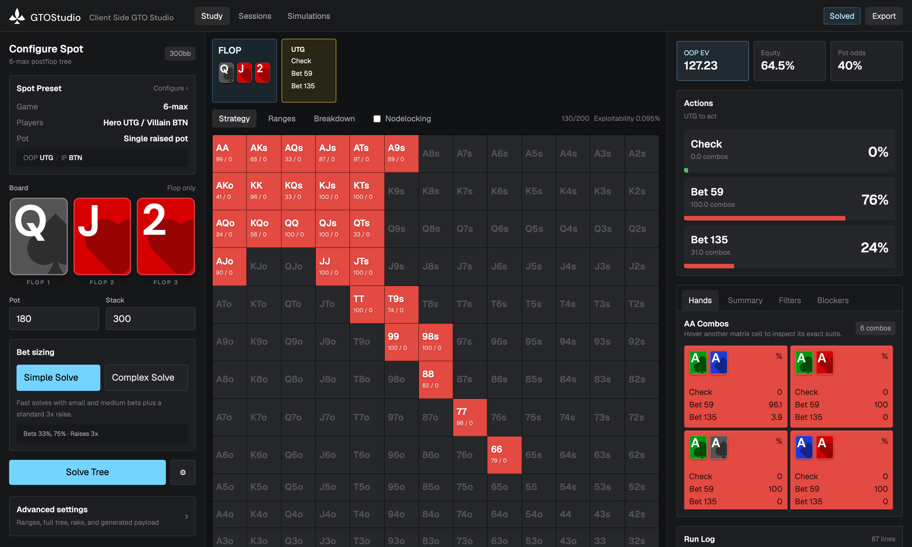
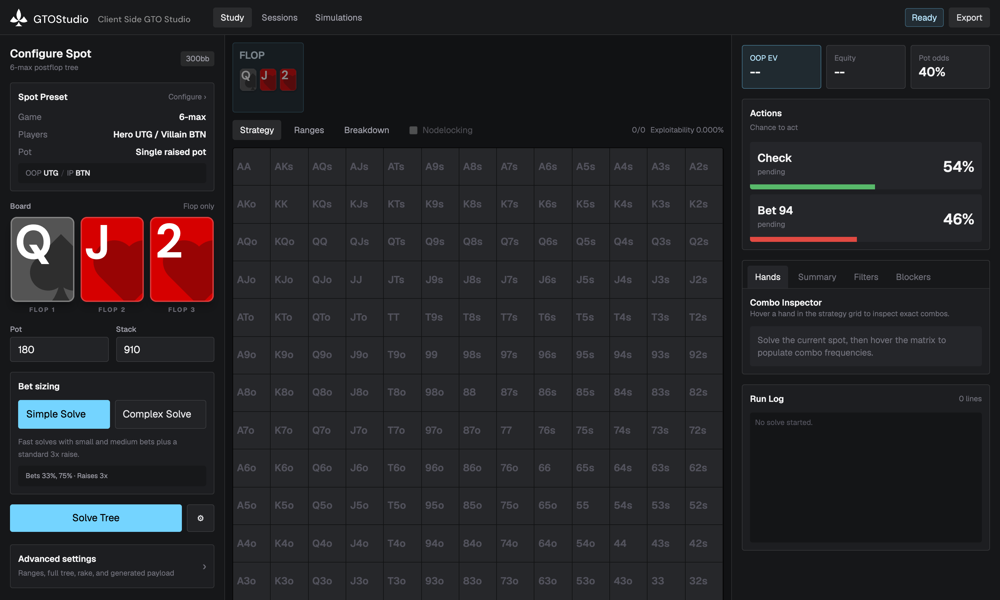
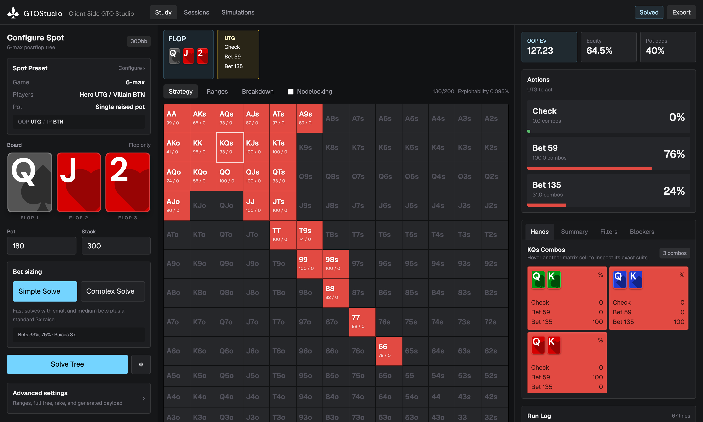
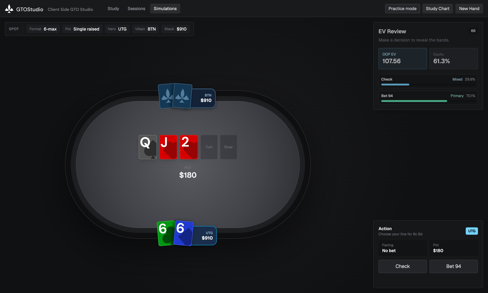

<div align="center">

# GTOStudio

**A free, open-source GTO poker solver that runs entirely in your browser.**

No server. No subscription. No upload. The solver is a Rust engine compiled to
multithreaded WebAssembly — every solve runs on your own CPU, and your hands
never leave your machine.

[](https://www.gnu.org/licenses/agpl-3.0)
[](https://nextjs.org)
[](engine/)



</div>

---

## Features

### Study mode — configure, solve, explore

Set up a spot the way you'd describe it at the table, not the way a solver
grammar wants it: game type (heads-up / 6-max / 9-max), positions, pot type
(limped through 4-bet), board, pot, and effective stack. Bet-sizing presets
(**Simple Solve** / **Complex Solve**) generate a sensible tree for you, and
**Advanced settings** exposes the full solver configuration — ranges, complete
tree definition, rake, and the raw generated payload — when you want control.

<div align="center">

</div>

After a solve you get the full picture at the current node:

- **13×13 strategy matrix**, color-coded by action mix, with bet/check
  frequencies per hand class
- **Combo inspector** — hover any cell to see the exact per-suit combos and
  their individual strategies (blockers matter, and this shows you exactly how)
- **EV, equity, and pot odds** for the player to act
- **Action-path navigation** — follow the game tree street by street through
  the breadcrumb bar: pick an action, deal a turn card, keep exploring the
  solved tree without re-solving
- **Nodelocking** — override the strategy at a node and re-solve to see how
  the equilibrium shifts in response

<div align="center">

</div>

### Simulations — drill against the solver

Practice mode deals you a hand from a solved spot on a poker table, asks for
your line, and grades your decision against the solver's strategy — with the
EV and equity bands revealed after you commit. Currently runs on a set of
pre-solved fixture spots.

<div align="center">

</div>

## How it works

```
┌────────────────────────────────────────────────────────────────┐
│  Browser                                                       │
│                                                                │
│  Next.js UI (React 19)                                         │
│      │  postMessage                                            │
│      ▼                                                         │
│  Solver Web Worker (web/public/solver-worker.js)               │
│      │  wasm-bindgen                                           │
│      ▼                                                         │
│  WASM engine (Rust, Discounted CFR)                            │
│      │  rayon work-stealing over SharedArrayBuffer             │
│      ▼                                                         │
│  N sub-workers (one per hardware thread)                       │
└────────────────────────────────────────────────────────────────┘
```

- The engine is a fork of [b-inary/postflop-solver], a heavily optimized
  Discounted CFR implementation, extended here with a
  [rayon-to-Web-Worker bridge](engine/wasm/src/rayon_adapter.rs) so solves use
  every core your machine has.
- Multithreaded WASM requires [cross-origin isolation]; the required
  COOP/COEP headers are set in [next.config.ts](web/next.config.ts). If you
  self-host behind a proxy, preserve those headers or solves will fall back to
  failure — `crossOriginIsolated` must be `true`.
- Solves iterate until a target exploitability is reached (early stop) or the
  iteration cap is hit. Live progress — iteration count, exploitability, and a
  run log with per-step timings — streams into the UI. Expect roughly 2
  minutes for shallow-stack trees up to ~10+ minutes for deep-stacked flop
  solves; memory-heavy trees automatically switch to 16-bit compressed
  storage.

[b-inary/postflop-solver]: https://github.com/b-inary/postflop-solver
[cross-origin isolation]: https://web.dev/articles/coop-coep

## Quick start

Prerequisites: Node.js 20+.

```bash
git clone https://github.com/royli25/gtostudio.git
cd gtostudio/web
npm install
npm run dev
```

Open http://localhost:3000. **No Rust toolchain needed** — the compiled WASM
engine (`web/public/solver_wasm_bg.wasm` and its bindings) is committed to the
repo, so the app runs out of the box.

## Building the engine from source

You only need this if you change the Rust code in `engine/`.

The WASM build uses nightly Rust with atomics, bulk-memory, and SIMD enabled,
and rebuilds `std` with those features (see
[engine/wasm/.cargo/config.toml](engine/wasm/.cargo/config.toml) — the flags
are applied automatically from there):

```bash
rustup toolchain install nightly
rustup +nightly target add wasm32-unknown-unknown
rustup +nightly component add rust-src

cd engine/wasm
cargo +nightly build --release
```

Then generate the JS bindings with `wasm-bindgen` (CLI version must match the
`wasm-bindgen` crate version in `engine/wasm/Cargo.toml`), targeting `web`,
with the outputs — `solver_wasm.js`, `solver_wasm_bg.wasm`, and the
`snippets/` worker helpers — copied into `web/public/`.

The native (non-WASM) engine builds on stable Rust:

```bash
cd engine
cargo test
cargo run --release --example basic
```

## Project structure

| Path | What it is |
|---|---|
| [`web/`](web/) | Next.js 16 app — UI, solver worker, prebuilt WASM |
| [`engine/`](engine/) | Rust solver engine (vendored fork of postflop-solver, AGPL-3.0) |
| [`engine/wasm/`](engine/wasm/) | WASM bindings + rayon/Web Worker threading adapter |
| [`docs/`](docs/) | Product requirement docs and screenshots |

## Roadmap

- **Ranges tab** — range composition, weighting, and comparison views
- **Breakdown tab** — street-by-street EV / equity / frequency breakdowns
- **Sessions** — save, revisit, and organize solved spots
- **Export** — download solve results
- **Simulations on live solves** — practice mode currently drills pre-solved
  fixture spots; the plan is to drill any spot you've solved yourself

Design docs for upcoming work live in [`docs/`](docs/).

## Credits & license

The solver engine is a fork of **[postflop-solver][b-inary/postflop-solver]**
by Wataru Inariba — an exceptional piece of open-source work that makes this
project possible. Upstream development is suspended; this fork adds WASM
multithreading support and serves as the backend for the GTOStudio UI.

This project is licensed under the **[GNU AGPL-3.0](engine/LICENSE)**,
inherited from the engine. If you host a modified version of GTOStudio for
others to use over a network, the AGPL requires you to make your modified
source available to them.
