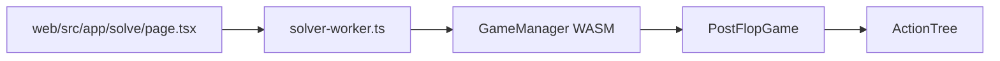

# Action Path Navigation PRD

## Summary

The post-solve experience should let users navigate a solved game tree the way GTO tools such as GTO Nexus do: by following a visible sequence of board cards and player actions across flop, turn, and river. A user should be able to solve once, click through the available actions and runout cards, and see the strategy, EV, equity, and range distribution for the selected node.

This document covers the product requirements for a GTO Nexus-style action path UI after a solve is complete. It includes breadcrumb rendering, action selection, chance-card navigation, worker history payloads, WASM API gaps, and nodelock implications.

## Goals

- Show the current solved-tree path as a clear street-by-street action timeline.
- Allow users to navigate from the root to any reachable solved node without re-solving.
- Support player actions and chance actions, including specific turn and river cards.
- Keep the current matrix and side panel synced to the selected node.
- Preserve the existing solver engine model instead of inventing a parallel tree representation in React.
- Define the minimum WASM additions needed to make navigation reliable.

## Non-Goals

- Replacing the solver algorithm or action-tree generation.
- Supporting multiway postflop solving.
- Importing commercial GTO Nexus trees or node formats.
- Adding tree editing in this phase beyond existing pre-solve bet-size configuration.
- Re-solving automatically after every navigation click.
- Building a full graph/tree visualizer in the first implementation.

## Current Architecture



Primary files:

- `web/src/app/solve/page.tsx`: owns solve UI, result state, matrix rendering, action summaries, and nodelock modal.
- `web/src/lib/solver-worker.ts`: receives page messages and calls `GameManager`.
- `web/public/solver-worker.js`: runtime worker copy loaded by the page.
- `engine/wasm/src/lib.rs`: exposes the WASM `GameManager` API.
- `engine/src/game/interpreter.rs`: implements `back_to_root`, `apply_history`, `play`, `available_actions`, `possible_cards`, `current_board`, `strategy`, `expected_values`, and `equity`.
- `engine/src/action_tree.rs`: defines action-tree construction, street transitions, player actions, and abstract chance actions.

## Current State

The solver engine already supports action-path navigation. `PostFlopGame` tracks action history, can reset to root, can apply a list of action indices, and can play player actions or chance cards.

The WASM wrapper already exposes:

- `apply_history(history: &[usize])`
- `back_to_root()`
- `play(action: usize)`
- `actions()`
- `num_actions()`
- `current_player()`
- `is_terminal_node()`
- `is_chance_node()`
- `strategy()`
- `expected_values(player)`
- `equity(player)`
- `private_cards(player)`

The current web UI does not keep a selected history. After solve completion, it requests root results only:

- `worker.postMessage({ type: "get_results", history: [] })`

The page renders the root node's available actions, but those action cards are not navigation controls. There is no breadcrumb timeline, no turn/river card picker, and no way to ask the worker for another node's results from the UI.

## Product Direction

The solved-tree page should be centered around a current node. The current node is defined by a history array that can be replayed from the root by the worker.

The visible action path should look conceptually like:

```text
FLOP Ah Jd Ts -> OOP Check -> IP Bet 8 -> OOP Call -> TURN 2c -> OOP Check -> IP Check -> RIVER 2d -> OOP to act
```

Each segment should be readable, clickable where appropriate, and visually grouped by street.

## User Stories

- As a poker student, I want to click `Check`, `Bet`, `Call`, or `Raise` after a solve and see the next node's strategy so I can study lines without re-solving.
- As a poker student, I want to choose a turn or river card when the tree reaches a chance node so I can inspect a specific runout.
- As a poker student, I want to click a previous breadcrumb segment to jump back to that node.
- As an advanced user, I want nodelock to apply to the currently selected node, not only the root.
- As a user comparing lines, I want the UI to make it obvious which player is to act and which prior actions produced the current strategy.

## UX Requirements

### Action Path Timeline

The top of the solve page should include an action path timeline.

Each node segment should show:

- Street label: `FLOP`, `TURN`, or `RIVER`.
- Board card(s) for that street.
- Acting player: `OOP`, `IP`, or `Chance`.
- Selected action, if the segment represents an action already taken.
- Current node highlight for the node being displayed.

The timeline should support:

- Root reset by clicking the flop segment.
- Jump-to-ancestor by clicking any previous action segment.
- Clear disabled styling while solving is in progress.
- Compact wrapping behavior for smaller screens.

### Available Actions

The existing `Actions` panel should become navigable after a solve.

Each action row should:

- Continue to show aggregate frequency.
- Be clickable when the current node is a player node.
- Append the selected action index to the current history.
- Request node results for the updated history.
- Disable navigation when the selected node is terminal or while the worker is busy.

### Chance Nodes

When the current node is a chance node, the UI should show a card-selection surface instead of player actions.

Requirements:

- Show legal turn or river cards only.
- Disable cards blocked by the current board.
- On click, append the selected card id to history.
- Request node results for the new history.
- Clearly label the control as `Choose turn card` or `Choose river card`.

The Rust engine's `play` method expects different values depending on node type:

- At player nodes, the value is the action index in `available_actions`.
- At chance nodes, the value is the actual card id.

The UI must not treat chance history entries as ordinary action indices.

### Current Node Results

When history changes, the UI should update:

- Acting player.
- Available actions.
- Strategy matrix.
- Combo rows.
- EV values.
- Equity values.
- Total bet amount, if shown.
- Nodelock modal target.

The result model should include enough metadata for the UI to render the node correctly without guessing.

## Worker And WASM Contract

### Existing Worker Message

The existing `get_results` message already accepts history:

```ts
worker.postMessage({ type: "get_results", history });
```

This should become the primary read path for node navigation.

### Required Worker State

The page should own `currentHistory`. The worker should remain mostly stateless for navigation by replaying history through `GameManager.apply_history`.

Recommended page state:

```ts
const [currentHistory, setCurrentHistory] = useState<number[]>([]);
const [pathSegments, setPathSegments] = useState<PathSegment[]>([]);
const [nodeLoading, setNodeLoading] = useState(false);
```

### Required Result Metadata

Extend the worker `results` response with:

- `history`: the replayed history.
- `currentBoard`: current board card ids.
- `isTerminal`: whether the selected node is terminal.
- `isChance`: whether the selected node is a chance node.
- `possibleCards`: bitset or array of legal chance cards.
- `totalBetAmount`: OOP/IP committed amounts.
- `actions`: player actions for non-terminal player nodes.
- `numActions`: action count for non-terminal player nodes.

### Required WASM Additions

The Rust engine already has `current_board()` and `possible_cards()` on `PostFlopGame`, but the WASM `GameManager` does not currently expose them. Add WASM methods:

```rust
pub fn current_board(&self) -> Box<[u8]>;
pub fn possible_cards(&self) -> u64;
pub fn history(&self) -> Box<[usize]>;
```

Optional but useful:

```rust
pub fn action_history_labels(&self) -> String;
```

If label generation stays in TypeScript, the worker can derive labels from previous `actions()` responses and card ids.

## Data Model

### PathSegment

```ts
interface PathSegment {
  id: string;
  kind: "street" | "action" | "chance";
  street: "flop" | "turn" | "river";
  historyIndex: number;
  label: string;
  player?: "oop" | "ip" | "chance";
  cardIds?: number[];
  actionIndex?: number;
  actionLabel?: string;
}
```

### SolveResults Extension

```ts
interface SolveResults {
  actions: string;
  numActions: number;
  player: string;
  privateCards: number[];
  rootEqIp: number;
  rootEqOop: number;
  rootEvIp: number;
  rootEvOop: number;
  strategy: number[];
  history: number[];
  currentBoard: number[];
  isTerminal: boolean;
  isChance: boolean;
  possibleCards: number[];
  totalBetAmount: number[];
}
```

The existing `rootEv*` names should eventually be renamed to `nodeEv*` or `rangeEv*` if they represent the selected node after navigation. If the values remain root-only, add separate selected-node EV fields.

## Implementation Plan

### Phase 1: Node Navigation Plumbing

- Add `currentHistory` state to `page.tsx`.
- Change solve completion to request `get_results` for `currentHistory`, initially `[]`.
- Add a helper such as `requestResultsForHistory(history)`.
- Make action rows clickable and append the selected action index.
- Add `nodeLoading` state to prevent duplicate navigation requests.
- Preserve existing root solve behavior.

### Phase 2: WASM Metadata

- Expose `current_board`, `possible_cards`, and `history` through `engine/wasm/src/lib.rs`.
- Update generated WASM bindings and worker typings.
- Extend `solver-worker.ts` and `web/public/solver-worker.js` to include node metadata in `results`.
- Return `actions` as empty for terminal and chance nodes.

### Phase 3: Chance Card UI

- Add a chance-card picker when `results.isChance` is true.
- Convert `possibleCards` into rank/suit buttons.
- Append selected card id to `currentHistory`.
- Request updated results after card selection.
- Display the selected turn/river card in the timeline.

### Phase 4: Action Timeline

- Add a top timeline component above the matrix.
- Render flop, turn, river, and action segments.
- Allow clicking previous segments to trim history and request ancestor results.
- Highlight the current node's acting player.
- Keep timeline usable on narrow screens.

### Phase 5: Nodelock Integration

- Change nodelock operations to use `currentHistory` instead of `[]`.
- Update modal copy to say which node/player is being locked.
- After a re-solve, request results for the same `currentHistory` if still valid.
- If the history becomes invalid after tree/config changes, fall back to root and show a log message.

## Validation And Error Handling

- If `apply_history` fails or panics in WASM, show a user-facing error and return to the nearest known valid history.
- If the selected node is terminal, show terminal summary instead of action rows.
- If the selected node is chance and no possible cards are returned, treat it as terminal.
- If config changes after a solve, clear `currentHistory` because action indices may no longer match the new tree.
- If the board is already river, chance navigation should never appear.

## Acceptance Criteria

- After solving a flop tree, clicking an available action updates the matrix and side panel for the next node.
- A breadcrumb/action timeline appears above the matrix and reflects the current line.
- Clicking an ancestor segment navigates back to that node without re-solving.
- Turn and river chance nodes present legal card choices.
- Selecting a turn or river card advances to the correct runout node.
- Nodelock applies to the currently selected node.
- Changing pre-solve config clears the selected history.
- Existing root solve behavior still works when no navigation is used.

## Open Questions

- Should the timeline show all action frequencies for the chosen action segment, or only the label?
- Should chance card selection use a full 52-card picker or a compact grid of legal cards?
- Should EV cards in the side panel be renamed from root EV to selected-node EV?
- Should the app support saving named lines for quick comparison?
- Should terminal nodes show fold/showdown EV details or simply indicate that the line ended?

## Future Enhancements

- Keyboard navigation through actions and breadcrumbs.
- Saved favorite lines.
- Side-by-side comparison of two branches.
- Search for a line by action notation.
- Mini tree map showing where the current node sits inside the solved tree.
- Browser URL query params for sharing a solved line if persistence is added.
