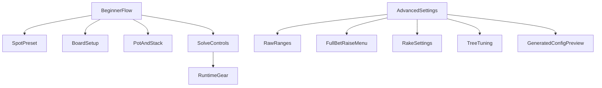

# Pre-Solve Configuration PRD

## Summary

The pre-solve experience should be beginner-first. A new user should be able to define a reasonable spot, choose the board, confirm pot and stack, and press `Solve Tree` without understanding raw solver grammar. Advanced users should still be able to inspect and override the full generated solver configuration through `Advanced Settings`.

This document covers everything that happens before `Solve Tree` is pressed: UI inputs, preset generation, validation, worker payload construction, and the WASM model contract.

## Goals

- Make the default solve setup approachable for beginner poker students.
- Preserve access to the solver's deeper configuration for advanced users.
- Clearly separate baseline controls from excessive solver controls.
- Document which engine inputs are currently connected to the UI and which are still hardcoded.
- Define implementation boundaries for the next pre-solve configuration cleanup.

## Non-Goals

- Replacing the solver algorithm.
- Rebuilding range science or importing verified commercial preflop ranges in this phase.
- Exposing native-only engine features that are not available through the current WASM wrapper unless explicitly scoped later.
- Optimizing solve performance beyond making tree-size tradeoffs more visible.

## Current Architecture

Primary files:

- `web/src/app/solve/page.tsx`: owns current UI state, preset heuristics, board selection, bet-size fields, solve settings, and `handleSolve`.
- `web/src/lib/solver-worker.ts`: defines the TypeScript worker contract and forwards config into `GameManager.init`.
- `web/public/solver-worker.js`: runtime worker currently loaded by the page.
- `engine/wasm/src/lib.rs`: exposes the WASM `GameManager.init` API and builds `CardConfig` plus `TreeConfig`.
- `engine/src/bet_size.rs`: defines accepted bet and raise size grammar.
- `engine/src/action_tree.rs`: defines `TreeConfig`, stack/rake constraints, donk sizes, all-in thresholds, and merge thresholds.
- `engine/src/range.rs`: defines accepted range strings and weights.

## Beginner-First Product Direction

The main sidebar should behave like a guided checklist, not a full solver control panel.

The beginner flow should ask only:

- Who is in the hand?
- What kind of pot is it?
- What is the board?
- What are the pot and effective stack?
- Start the solve.

Everything else should be summarized or moved into `Advanced Settings`.

## Beginner Baseline Surface

The primary sidebar should contain:

1. Spot preset summary
   - Game type.
   - Hero position.
   - Villain position.
   - Pot type.
   - OOP/IP mapping summary.
   - A `Configure` action that opens the existing spot preset popup.

2. Board selector
   - Five card slots: flop, turn, river.
   - Rank-then-suit selection.
   - Duplicate board card prevention.
   - Required flop validation before solve.

3. Pot and stack
   - `startingPot`.
   - `effectiveStack`.
   - Positive-number validation.

4. Baseline bet-size summary
   - A compact summary such as `Beginner baseline` or `Standard SRP sizes`.
   - Do not expose raw every-street strings in the main sidebar.
   - Advanced users can edit the underlying menus in `Advanced Settings`.

5. Solve controls
   - `Solve Tree`.
   - Gear button for runtime basics only:
     - Iterations.
     - Target exploitability as percent of pot.

## Advanced Settings Surface

`Advanced Settings` should be the home for controls that are powerful but excessive for beginners.

Advanced settings should include:

- Raw range controls:
  - OOP range.
  - IP range.
  - Reset to current preset.
  - Clear indication when manual edits diverge from the selected preset.

- Full action tree controls:
  - OOP flop bet.
  - OOP flop raise.
  - IP flop bet.
  - IP flop raise.
  - OOP turn bet.
  - OOP turn raise.
  - IP turn bet.
  - IP turn raise.
  - OOP river bet.
  - OOP river raise.
  - IP river bet.
  - IP river raise.
  - Inline grammar help for `%`, `x`, `c`, `e`, and `a`.

- Tree tuning:
  - `addAllinThreshold`.
  - `forceAllinThreshold`.
  - `mergingThreshold`.

- Rake:
  - `rakeRate`.
  - `rakeCap`.

- Generated config preview:
  - Show the exact payload that will be sent to the worker.
  - Highlight values changed from the beginner baseline.
  - Warn when the number of bet/raise options may create a large tree.

- Future WASM extensions:
  - Turn donk sizes.
  - River donk sizes.
  - Compression or memory options if exposed.

## Model Contract

The WASM `GameManager.init` accepts the pre-solve model inputs. The current UI and worker should be understood as a view over this contract.

### Ranges

Inputs:

- `oop_range`.
- `ip_range`.

Format:

- Comma-separated range groups.
- Optional weights, for example `K9s:.67`, `88+:1.`, `98s-65s:0.25`.
- Supported groups include singleton hands, plus ranges, dash ranges, and suit-specific combos.
- Weights must be between `0.0` and `1.0`.

Current UI:

- Presets generate heuristic OOP/IP ranges from game type, Hero/Villain positions, and pot type.
- `Advanced Settings` exposes raw OOP/IP textareas.
- The preset range source is heuristic and should be labeled as such until replaced with a verified range library.

### Board And Street

Input:

- `board` as card ids.

Behavior:

- The WASM wrapper requires at least three cards because it copies the first three into the flop.
- A 3-card board starts on flop.
- A 4-card board starts on turn.
- A 5-card board starts on river.

Current UI:

- Five slots are available.
- Duplicate selected cards are disabled.
- The UI can still reach solve with fewer than three cards; this should be blocked before worker initialization.

### Pot, Stack, And Rake

Inputs:

- `starting_pot`.
- `effective_stack`.
- `rake_rate`.
- `rake_cap`.

Constraints:

- Starting pot must be greater than `0`.
- Effective stack must be greater than `0`.
- Rake rate must be between `0.0` and `1.0`.
- Rake cap must be non-negative.

Current UI:

- Pot and stack are visible in the main sidebar.
- Rake is not exposed.
- `handleSolve` sends `rakeRate: 0` and `rakeCap: 0`.

Product direction:

- Keep pot and stack visible.
- Move rake into `Advanced Settings`.

### Bet And Raise Menus

Inputs:

- `oop_flop_bet`.
- `oop_flop_raise`.
- `ip_flop_bet`.
- `ip_flop_raise`.
- `oop_turn_bet`.
- `oop_turn_raise`.
- `ip_turn_bet`.
- `ip_turn_raise`.
- `oop_river_bet`.
- `oop_river_raise`.
- `ip_river_bet`.
- `ip_river_raise`.

Accepted grammar:

- `70%`: pot-relative.
- `2.5x`: previous-bet-relative, valid only for raises.
- `100c`: fixed chip amount.
- `20c3r`: fixed-limit style raise cap, valid only for raises.
- `e`, `2e`, `3e200%`: geometric sizes.
- `a`: all-in.
- Multiple choices are comma-separated, for example `50%, 100c, 2e, a`.

Current UI:

- The sidebar exposes only four fields:
  - OOP flop bet.
  - IP flop bet.
  - Turn bet.
  - River bet.
- These fields can technically receive comma-separated grammar, but the UI labels them as simple pot-relative values.
- `handleSolve` hardcodes all raise sizes as `45%`.
- `handleSolve` uses the same turn bet value for OOP and IP.
- `handleSolve` uses the same river bet value for OOP and IP.

Product direction:

- Main sidebar should show only a beginner-friendly bet-size preset summary.
- Full bet/raise strings belong in `Advanced Settings`.
- Advanced settings should validate raw grammar before solve.

### Tree Tuning

Inputs:

- `add_allin_threshold`.
- `force_allin_threshold`.
- `merging_threshold`.

Behavior:

- `add_allin_threshold` adds all-in if max bet is below a pot ratio threshold.
- `force_allin_threshold` forces all-in if SPR after call is below a threshold.
- `merging_threshold` merges nearby bet sizes with a Pio-style algorithm.
- `0.0` disables each option.

Current UI:

- Not exposed.
- `handleSolve` sends all three as `0`.

Product direction:

- Move these into `Advanced Settings`.
- Use beginner defaults that reduce surprising tree growth without requiring users to understand the knobs.

### Donk Sizes

Engine capability:

- Native `TreeConfig` supports turn and river donk sizes.

Current WASM:

- `engine/wasm/src/lib.rs` hardcodes `turn_donk_sizes: None` and `river_donk_sizes: None`.
- The current UI and worker cannot configure them.

Product direction:

- Document as future advanced functionality.
- Do not expose in UI until the WASM wrapper accepts them.

### Solve Runtime

Inputs sent after initialization:

- `maxIterations`.
- `targetExploitability`.

Current UI:

- Exposed in a gear modal next to `Solve Tree`.
- `targetExploitability` is derived as `(startingPot * targetExpl) / 100`.

Product direction:

- Keep these in the gear modal.
- They are acceptable beginner-facing controls because they directly affect solve time and accuracy.

## Current UI Wiring Audit

The page currently owns all pre-solve state in `web/src/app/solve/page.tsx`.

Connected to the worker:

- OOP/IP ranges.
- Board.
- Starting pot.
- Effective stack.
- Four visible bet-size fields.
- Solve iterations.
- Target exploitability.

Hardcoded before worker init:

- Rake rate: `0`.
- Rake cap: `0`.
- OOP flop raise: `45%`.
- IP flop raise: `45%`.
- OOP turn raise: `45%`.
- IP turn raise: `45%`.
- OOP river raise: `45%`.
- IP river raise: `45%`.
- Add all-in threshold: `0`.
- Force all-in threshold: `0`.
- Merging threshold: `0`.

Not connected through WASM:

- Turn donk sizes.
- River donk sizes.

Validation gaps:

- Flop completion should be validated before solve.
- Pot and stack should reject non-positive values before solve.
- Raw range strings should be validated or at least fail with targeted messages.
- Raw bet-size strings should be validated before worker initialization.
- Advanced edits should indicate whether the spot is still using the baseline preset.

## Recommended UX Hierarchy

## Baseline Defaults

The beginner baseline should generate solver inputs that are usable without manual tuning.

Recommended initial defaults:

- Ranges:
  - Continue using heuristic preset ranges until a verified library is added.
  - Label them as starter ranges.

- Bet and raise menus:
  - Single raised pot: compact normal sizes, for example flop `33%, 75%`, turn `50%, 100%`, river `75%, 125%`, raises `2.5x`.
  - 3-bet and 4-bet pots: fewer branches by default, for example one primary bet size and a raise/all-in option.
  - Limped pots: conservative smaller menus.

- Tree tuning:
  - Keep defaults conservative.
  - If thresholds are introduced, show them only in advanced.

- Rake:
  - Default to `0` unless a rake profile system is added.

## Implementation Phases

### Phase 1: Documentation And Framing

- Add this PRD.
- Keep the plan file unchanged.
- Use the PRD as the source of truth for the next UI implementation.

### Phase 2: Beginner Sidebar Cleanup

- Convert `Bet Sizes` from raw fields into a compact beginner summary.
- Keep spot preset, board, pot, stack, and solve controls in the main sidebar.
- Add pre-solve validation for board, pot, and stack.

### Phase 3: Advanced Settings Expansion

- Move raw ranges into a clearer `Ranges` section.
- Add full bet/raise controls for all worker-supported fields.
- Add rake and threshold controls.
- Add generated config preview.
- Add reset-to-baseline behavior.

### Phase 4: Optional WASM Expansion

- Expose turn and river donk sizes through `engine/wasm/src/lib.rs` if needed.
- Consider exposing memory compression if the product needs it.

## Acceptance Criteria

- The document identifies every pre-solve model input exposed through WASM.
- The document distinguishes model capability from current UI wiring.
- The document identifies hardcoded values currently sent to the worker.
- The document clearly separates beginner baseline controls from `Advanced Settings`.
- The main flow remains approachable for beginners and does not require raw solver grammar.
- The next implementation can proceed without rediscovering the engine API.
